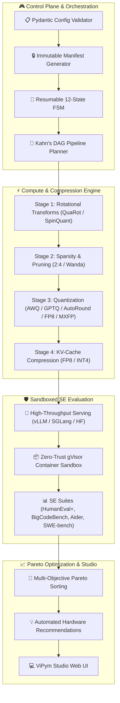

<div align="center">

# ⚡ ViPym
### *Compress LLMs Without Losing Code Quality*

[](https://opensource.org/licenses/MIT)
[](https://www.python.org/)
[](https://pytorch.org/)
[](https://github.com/vllm-project/vllm)
[](https://github.com/astral-sh/ruff)
[](https://github.com/vfcarida/ViPym)
[](https://github.com/vfcarida/ViPym/actions)

<p align="center">
  <strong>The open-source reference framework for multi-stage LLM compression, zero-trust software engineering benchmark validation, and Pareto cost/quality optimization.</strong>
</p>

<p align="center">
  <a href="#-quickstart-in-3-commands">Quickstart</a> •
  <a href="#-comparison-with-existing-tools">Comparison</a> •
  <a href="#-pre-built-recipes-hub">Recipes Hub</a> •
  <a href="#-system-architecture">Architecture</a> •
  <a href="#-vipym-studio-web-dashboard">ViPym Studio</a> •
  <a href="docs/troubleshooting.md">Troubleshooting</a> •
  <a href="docs/runbook.md">Runbook</a> •
  <a href="docs/use-cases/se-lifecycle.md">Use Cases</a> •
  <a href="docs/adr/">Architecture Decisions</a>
</p>

</div>

---

## 🚀 Quickstart in 3 Commands

Run a complete model compression, sandboxed HumanEval evaluation, and Pareto analysis in **under 2 minutes** on any standard laptop without requiring a GPU or cloud setup:

```bash
# 1. Clone and install in editable mode
git clone https://github.com/vfcarida/ViPym.git && cd ViPym && pip install -e ".[dev]"

# 2. Run the 5-minute CPU quickstart demo
vipym run recipes/quick-demo-gpt2.yaml --output results/

# 3. Launch interactive ViPym Studio to explore Pareto charts & recommendations
vipym studio --artifacts-dir results/
```

Open `http://127.0.0.1:8080` in your web browser to explore interactive 3D/2D Pareto frontiers, stage telemetry, and automated deployment recommendations.

---

## 📊 Comparison with Existing Tools

| Capability | **ViPym** | **vLLM / llm-compressor** | **AutoGPTQ / AutoAWQ** | **Manual Ad-hoc Scripts** |
| :--- | :---: | :---: | :---: | :---: |
| **Directed Acyclic Compression DAGs** | **Yes** (Kahn Topological Sort) | No (Linear Only) | No (Single Stage) | No |
| **Massive MoE Surgery (2.8T Kimi K3, DeepSeek)** | **Yes** (Profiling + Surgical Pruning + Merging) | Limited | No | No |
| **Sandboxed SE Benchmarks (HumanEval+, BigCodeBench, SWE-bench)** | **Yes** (Integrated gVisor/Docker Isolation) | No (External lm-eval) | No (Perplexity only) | Fragile |
| **Multi-Objective Pareto Optimization** | **Yes** (Quality $\times$ VRAM $\times$ Latency $\times$ Cost) | No | No | No |
| **Enterprise Cloud Cost Projections (15k Devs)** | **Yes** (Automated ROI Modeling) | No | No | No |
| **Interactive Web UI & Real-Time Telemetry** | **Yes** (ViPym Studio + WebSocket) | No | No | No |
| **Resumable 12-State FSM Engine** | **Yes** (Crash-resilient Checkpoints) | No | No | No |
| **Security: Zero-Trust Code Sandboxing** | **Yes** (`--network=none`, AST checks) | No | No | None |

---

## 📦 Pre-Built Recipes Hub

ViPym provides battle-tested, schema-validated recipes ready to execute for common scenarios:

| Recipe Configuration | Scenario / Architecture | Target Model | Highlights |
| :--- | :--- | :--- | :--- |
| [`recipes/quick-demo-gpt2.yaml`](file:///c:/Users/vinicius/Documents/GeminiCodes/ViPym/recipes/quick-demo-gpt2.yaml) | **5-Minute CPU Demo** | `GPT-2 (124M)` | Wanda 50% + GPTQ 4-bit, instant local run |
| [`recipes/mixtral-compression.yaml`](file:///c:/Users/vinicius/Documents/GeminiCodes/ViPym/recipes/mixtral-compression.yaml) | **MoE Architecture Showcase** | `Mixtral-8x7B (47B MoE)` | 25% Expert Pruning + AWQ W4A16 + FP8 KV |
| [`recipes/kimi-k3-full.yaml`](file:///c:/Users/vinicius/Documents/GeminiCodes/ViPym/recipes/kimi-k3-full.yaml) | **Production 2.8T MoE Pipeline** | `Moonshot AI Kimi K3` | QuaRot Transform + AWQ W4A16 + FP8 KV |
| [`recipes/cost-optimized-se.yaml`](file:///c:/Users/vinicius/Documents/GeminiCodes/ViPym/recipes/cost-optimized-se.yaml) | **Maximum Cost Reduction ($/1M)** | `Qwen2.5-Coder-7B` | 2:4 Sparsity + GPTQ 4-bit ($0.15/1M tokens) |
| [`recipes/quality-first-se.yaml`](file:///c:/Users/vinicius/Documents/GeminiCodes/ViPym/recipes/quality-first-se.yaml) | **Near-Lossless (99.8% Pass@1)** | `Qwen2.5-Coder-32B` | Static FP8 Quantization + FP8 KV-Cache |

Execute any recipe with:
```bash
vipym run recipes/cost-optimized-se.yaml --output results/
```

---

## 🧩 System Architecture



---

## 💻 ViPym Studio: Interactive Web Dashboard

ViPym Studio provides an intuitive, hardened UI for monitoring live experiments and exploring Pareto trade-offs:
- **3D & 2D Pareto Explorer**: Visualize Quality vs Latency vs VRAM vs Serving Cost.
- **Real-Time WebSocket Stream**: Live telemetry and progress updates per layer and expert.
- **Enterprise Security**: Bearer token authentication, rate limiting (100 req/min), audit logging, and read-only mode (`--read-only`).

```bash
vipym studio --port 8080 --artifacts-dir results/
```

---

## 📚 Documentation & Architecture Decision Records

- [Architecture Overview](docs/architecture.md) — Subsystem designs, interfaces, and data flow.
- [Evaluation Methodology](docs/benchmarks.md) — SE benchmark suites, metric definitions, and sandboxing.
- [Software Engineering Use Case](docs/use-cases/se-lifecycle.md) — Detailed end-to-end guide on Kimi K3 and enterprise ROI.
- [5-Minute Quickstart](docs/use-cases/quick-start.md) — CPU-only demonstration.
- **Architecture Decision Records (ADRs)**:
  - [ADR-001: DAG over Linear Pipeline](docs/adr/ADR-001-dag-over-linear-pipeline.md)
  - [ADR-002: MoE-First Architecture Design](docs/adr/ADR-002-moe-first-design.md)
  - [ADR-003: SE Benchmarks over Generic Evaluations](docs/adr/ADR-003-se-benchmarks-over-generic-evals.md)
  - [ADR-004: Pydantic v2 for Unified Configuration](docs/adr/ADR-004-pydantic-v2-for-configuration.md)
  - [ADR-005: Decoupled Plugin Registries](docs/adr/ADR-005-plugin-architecture-for-extensibility.md)

---

## 🤝 Contributing

We welcome contributions! Please see [CONTRIBUTING.md](CONTRIBUTING.md) for instructions on adding new compression methods, evaluation suites, and model adapters.

---

## 📄 License

ViPym is open-source software released under the [MIT License](LICENSE).
