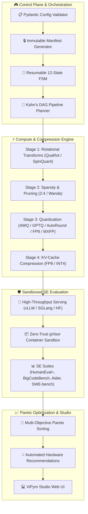

<div align="center">

# ⚡ ViPym
### *Compress LLMs Without Losing Code Quality*

[](https://opensource.org/licenses/MIT)
[](https://www.python.org/)
[](https://pytorch.org/)
[](https://github.com/vllm-project/vllm)
[](https://github.com/astral-sh/ruff)
[](https://github.com/vfcarida/ViPym)
[](https://github.com/vfcarida/ViPym/actions)

<p align="center">
  <strong>The open-source reference framework for multi-stage LLM compression, zero-trust software engineering benchmark validation, and Pareto cost/quality optimization.</strong>
</p>

<p align="center">
  <a href="#-quickstart-in-3-commands">Quickstart</a> •
  <a href="#-comparison-with-existing-tools">Comparison</a> •
  <a href="#-pre-built-recipes-hub">Recipes Hub</a> •
  <a href="#-multi-experiment-grid-sweeps-vipym-sweep">Sweeps</a> •
  <a href="#-system-architecture">Architecture</a> •
  <a href="#-vipym-studio-interactive-web-dashboard--live-playground">ViPym Studio</a> •
  <a href="docs/troubleshooting.md">Troubleshooting</a> •
  <a href="docs/runbook.md">Runbook</a> •
  <a href="docs/use-cases/se-lifecycle.md">Use Cases</a> •
  <a href="docs/adr/">Architecture Decisions</a>
</p>

</div>

---

## 🚀 Quickstart in 3 Commands

Run a complete model compression, sandboxed HumanEval evaluation, and Pareto analysis in **under 2 minutes** on any standard laptop without requiring a GPU or cloud setup:

```bash
# 1. Clone and install in editable mode with Studio support
git clone https://github.com/vfcarida/ViPym.git && cd ViPym && pip install -e ".[dev,studio]"

# 2. Run the 5-minute CPU quickstart demo
vipym run recipes/quick-demo-gpt2.yaml --output results/

# 3. Launch interactive ViPym Studio to explore Pareto charts & recommendations
vipym studio --artifacts-dir results/
```

Open `http://127.0.0.1:8080` in your web browser to explore interactive 3D/2D Pareto frontiers, stage telemetry, and automated deployment recommendations.

### Python API Quickstart

Prefer Python scripts over CLI commands? Run pipelines programmatically:

```python
from vipym.config.schema import EvaluationConfig, ModelConfig, ServingConfig, ViPymExperimentConfig
from vipym.experiments.runner import ResumableExperimentRunner

# Define compression pipeline and sandboxed benchmark evaluation
config = ViPymExperimentConfig(
    experiment_id="quickstart-awq",
    model=ModelConfig(id="HuggingFaceTB/SmolLM-135M"),
    compression_pipeline=[{"stage_id": "awq", "method": "awq", "scheme": "W4A16"}],
    serving=ServingConfig(backend="vllm"),
    evaluation=EvaluationConfig(suites=["humaneval"], task_limit=5),
)
summary = ResumableExperimentRunner(config=config, artifacts_dir="./results").run()
print(
    f"Pass@1: {summary.compressed_points[0].quality_score * 100:.1f}% | Pareto Optimal: {summary.compressed_points[0].is_pareto_optimal}"
)
```

---

## 📊 Comparison with Existing Tools

| Capability | **ViPym** | **vLLM / llm-compressor** | **AutoGPTQ / AutoAWQ** | **Manual Ad-hoc Scripts** |
| :--- | :---: | :---: | :---: | :---: |
| **Directed Acyclic Compression DAGs** | **Yes** (Kahn Topological Sort) | No (Linear Only) | No (Single Stage) | No |
| **Massive MoE Surgery (2.8T Kimi K3, DeepSeek)** | **Yes** (Profiling + Surgical Pruning + Merging) | Limited | No | No |
| **Sandboxed SE Benchmarks (HumanEval+, BigCodeBench, SWE-bench)** | **Yes** (Integrated gVisor/Docker Isolation) | No (External lm-eval) | No (Perplexity only) | Fragile |
| **Multi-Objective Pareto Optimization** | **Yes** (Quality $\times$ VRAM $\times$ Latency $\times$ Cost) | No | No | No |
| **Enterprise Cloud Cost Projections (15k Devs)** | **Yes** (Automated ROI Modeling) | No | No | No |
| **Interactive Web UI & Real-Time Telemetry** | **Yes** (ViPym Studio + WebSocket) | No | No | No |
| **Resumable 12-State FSM Engine** | **Yes** (Crash-resilient Checkpoints) | No | No | No |
| **Security: Zero-Trust Code Sandboxing** | **Yes** (`--network=none`, AST checks) | No | No | None |

---

## 📦 Pre-Built Recipes Hub

ViPym provides battle-tested, schema-validated recipes ready to execute for common scenarios:

| Recipe Configuration | Scenario / Architecture | Target Model | Highlights |
| :--- | :--- | :--- | :--- |
| [`recipes/quick-demo-gpt2.yaml`](recipes/quick-demo-gpt2.yaml) | **5-Minute CPU Demo** | `GPT-2 (124M)` | Wanda 50% + GPTQ 4-bit, instant local run |
| [`recipes/mixtral-compression.yaml`](recipes/mixtral-compression.yaml) | **MoE Architecture Showcase** | `Mixtral-8x7B (47B MoE)` | 25% Expert Pruning + AWQ W4A16 + FP8 KV |
| [`recipes/kimi-k3-full.yaml`](recipes/kimi-k3-full.yaml) | **Production 2.8T MoE Pipeline** | `Moonshot AI Kimi K3` | QuaRot Transform + AWQ W4A16 + FP8 KV |
| [`recipes/cost-optimized-se.yaml`](recipes/cost-optimized-se.yaml) | **Maximum Cost Reduction ($/1M)** | `Qwen2.5-Coder-7B` | 2:4 Sparsity + GPTQ 4-bit ($0.15/1M tokens) |
| [`recipes/quality-first-se.yaml`](recipes/quality-first-se.yaml) | **Near-Lossless (99.8% Pass@1)** | `Qwen2.5-Coder-32B` | Static FP8 Quantization + FP8 KV-Cache |
| [`recipes/sweep-demo-quant-kvc.yaml`](recipes/sweep-demo-quant-kvc.yaml) | **Multi-Stage Parameter Sweep** | `GPT-2 (124M)` | Grid Sweep (AWQ 4/8-bit + FP8/INT4 KV) with Pareto Discovery |

Execute any recipe with:
```bash
vipym run recipes/cost-optimized-se.yaml --output results/
```

### Verified Models Matrix

ViPym continuously verifies compression accuracy and benchmark stability across foundational and code intelligence architectures:

| Model Family | Representative Checkpoints | Architecture | Validated Compression Pipelines | Tested Benchmark Suites |
| :--- | :--- | :--- | :--- | :--- |
| **Qwen2.5-Coder** | `7B`, `14B`, `32B` | Dense Causal | AWQ W4A16, GPTQ 4-bit, 2:4 Sparsity, FP8 KV | HumanEval+, MBPP, SWE-bench |
| **DeepSeek-Coder-V2** | `16B (2.4B active)`, `236B` | MoE MLA | Routing Profiler, Expert Pruning, AWQ W4A16 | BigCodeBench, HumanEval, Aider |
| **StarCoder2** | `3B`, `7B`, `15B` | Dense Causal | AutoRound, SmoothQuant W8A8, Wanda Sparsity | HumanEval, MBPP, EvalPlus |
| **CodeLlama / LLaMA-3.1** | `8B`, `70B` | Dense GQA | QuaRot, SpinQuant, FP8 Static, FP8 KV | HumanEval, LiveCodeBench, SWE-bench |
| **Kimi K3** | `2.8T MoE` | Extreme MoE | Router Distillation, Expert Merging, FP8 KV | SWE-bench, BigCodeBench, Aider |
| **SmolLM** | `135M`, `360M`, `1.7B` | Dense Lightweight | CPU Smoke Test, AWQ, GPTQ, Logit Distillation | HumanEval, MBPP (Fast CI/CD) |

---

## 🧩 System Architecture



---

## 🔬 Multi-Experiment Grid Sweeps (`vipym sweep`)

ViPym supports automated hyperparameter exploration across compression algorithms, bit-widths, sparsity levels, and KV-cache formats with checkpoint resumption and automated non-dominated Pareto frontier discovery:

```bash
# Run a parameter sweep across AWQ bit-widths and KV-Cache formats
vipym sweep --config recipes/sweep-demo-quant-kvc.yaml --output sweeps/
```

### Example Sweep Recipe (`recipes/sweep-demo-quant-kvc.yaml`):
```yaml
base_recipe: recipes/quick-demo-gpt2.yaml
grid:
  stages.0.parameters.bits: [4, 8]
  stages.1.parameters.kv_bits: [4, 8]
objectives:
  - quality
  - latency_ms
  - vram_gb
  - cost_per_million
checkpoint_interval: 1
```

During execution, ViPym checkpoints progress in `state.json`, captures each evaluated configuration in `points/*.json`, and automatically computes the optimal non-dominated candidates:

```
┌────────────────────────────────────── Pareto Frontier ──────────────────────────────────────┐
│ Run ID     Bits   KV-Bits   Quality (Pass@1)   Latency (p50)   Peak VRAM   Cost / 1M Tk   │
├─────────────────────────────────────────────────────────────────────────────────────────────┤
│ point_000     4         4            64.2 %         14.2 ms      2.1 GB         $0.08   │
│ point_001     4         8            67.8 %         18.4 ms      2.8 GB         $0.11   │
│ point_003     8         8            72.1 %         24.1 ms      4.2 GB         $0.19   │
└─────────────────────────────────────────────────────────────────────────────────────────────┘
```

---

## 💻 ViPym Studio: Interactive Web Dashboard & Live Playground

ViPym Studio is an enterprise-grade, high-concurrency ASGI application powered by **FastAPI and Uvicorn**, providing real-time telemetry, model interaction, and decision support:

- **Live Model Playground**: Interactive token generation interface with Server-Sent Events (SSE) streaming (`POST /api/inference/generate`) featuring typewriter output, real-time Time-to-First-Token (TTFT), and token/sec throughput gauges.
- **Topological DAG Visualizer**: Dynamic interactive graph representing Kahn's DAG execution stages, intermediate tensors, and multi-parent model fusion.
- **MoE Co-Activation Matrix**: Real-time expert routing correlation matrix visualizing co-firing expert clusters in Mixtral, DeepSeek, and Kimi architectures.
- **3D & 2D Pareto Explorer**: Interactive Plotly scatter plots mapping Quality vs. Latency vs. VRAM vs. Serving Cost ($/1M tokens).
- **Multi-Format Report Export**: One-click download of synthesized evaluation reports in Markdown, LaTeX publication tables, and raw JSON.
- **Real-Time Push Stream**: Authenticated WebSocket (`/ws/progress`) delivering live step-by-step progress and hardware telemetry.
- **Hardened Security**: Bearer token authentication (`VIPYM_API_TOKEN`), per-client rate limiting (100 requests/minute), audit logging, and read-only mode (`--read-only`).

```bash
# Launch Studio locally on port 8080
vipym studio --port 8080 --artifacts-dir results/

# Launch in secure read-only mode with custom API token
VIPYM_API_TOKEN="secret-token" vipym studio --port 8080 --artifacts-dir results/ --read-only
```

---

## 📚 Documentation & Architecture Decision Records

- [Architecture Overview](docs/architecture.md) — Subsystem designs, interfaces, and data flow.
- [Evaluation Methodology](docs/benchmarks.md) — SE benchmark suites, metric definitions, and sandboxing.
- [Software Engineering Use Case](docs/use-cases/se-lifecycle.md) — Detailed end-to-end guide on Kimi K3 and enterprise ROI.
- [5-Minute Quickstart](docs/use-cases/quick-start.md) — CPU-only demonstration.
- **Architecture Decision Records (ADRs)**:
  - [ADR-001: DAG over Linear Pipeline](docs/adr/ADR-001-dag-over-linear-pipeline.md)
  - [ADR-002: MoE-First Architecture Design](docs/adr/ADR-002-moe-first-design.md)
  - [ADR-003: SE Benchmarks over Generic Evaluations](docs/adr/ADR-003-se-benchmarks-over-generic-evals.md)
  - [ADR-004: Pydantic v2 for Unified Configuration](docs/adr/ADR-004-pydantic-v2-for-configuration.md)
  - [ADR-005: Decoupled Plugin Registries](docs/adr/ADR-005-plugin-architecture-for-extensibility.md)
  - [ADR-006: Hardened Sandboxing and gVisor Container Isolation](docs/adr/ADR-006-gvisor-sandboxing.md)
  - [ADR-007: Resumable Experiment Lifecycle State Machine](docs/adr/ADR-007-resumable-experiment-state-machine.md)
  - [ADR-008: Open-Source Licensing Standardization](docs/adr/ADR-008-open-source-licensing-standardization.md)

---

## 📜 Citation

If you use ViPym in your academic research, benchmark evaluations, or enterprise optimization workflows, please cite:

```bibtex
@software{carida2026vipym,
  author       = {Vinicius Carid{\'a}},
  title        = {{ViPym: Shrinking LLMs, Preserving Intelligence}},
  year         = {2026},
  publisher    = {GitHub},
  version      = {0.2.0},
  url          = {https://github.com/vfcarida/ViPym}
}
```

---

## 🤝 Contributing

We welcome contributions! Please see [CONTRIBUTING.md](CONTRIBUTING.md) for instructions on adding new compression methods, evaluation suites, and model adapters.

---

## 📄 License

ViPym is open-source software released under the [MIT License](LICENSE).
