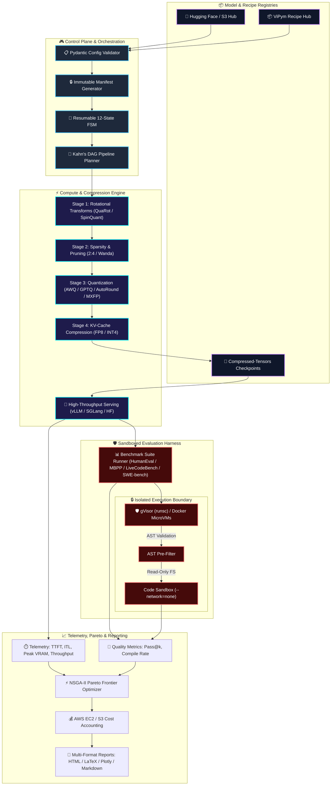
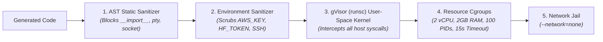

<div align="center">

# ⚡ ViPym
### *Shrinking LLMs, Preserving Intelligence*

[](https://opensource.org/licenses/MIT)
[](https://www.python.org/)
[](https://pytorch.org/)
[](https://github.com/vllm-project/vllm)
[](https://github.com/astral-sh/ruff)
[](https://github.com/vfcarida/ViPym)

<p align="center">
  <strong>An end-to-end open-source research and engineering framework for discovering how aggressively frontier Large Language Models (Dense & MoE) can be compressed while preserving task intelligence, code reasoning, and cost efficiency.</strong>
</p>

<p align="center">
  <a href="#-quickstart-guide">Quickstart</a> •
  <a href="#-vipym-studio-web-dashboard">ViPym Studio</a> •
  <a href="#-recipe-hub">Recipe Hub</a> •
  <a href="#-system-architecture">Architecture</a> •
  <a href="#-compression-taxonomy">Taxonomy</a> •
  <a href="#-security--gvisor-sandboxing">Security</a> •
  <a href="#-extending-vipym">Plugins</a>
</p>

</div>

---

## 🌟 Key Highlights

<table>
  <tr>
    <td width="50%">
      <h3>🧩 Non-Linear DAG Pipelines</h3>
      Compose arbitrary Directed Acyclic Graphs of compression stages (e.g. <code>QuaRot ➔ 2:4 Sparsity ➔ AWQ ➔ FP8 KV</code>) with automated Kahn topological sorting and cyclic dependency validation.
    </td>
    <td width="50%">
      <h3>🧠 Frontier MoE Introspection</h3>
      Native support for massive Mixture-of-Experts architectures up to <strong>2.8 Trillion parameters</strong> (e.g. Moonshot AI <strong>Kimi K3</strong> with 896 routed + 2 shared experts, 104B active per token).
    </td>
  </tr>
  <tr>
    <td width="50%">
      <h3>📊 Multi-Objective Pareto Optimization</h3>
      Automated non-dominated Pareto frontier sorting across continuous objective spaces: <strong>Quality (Pass@1) $\times$ Peak VRAM Footprint $\times$ Latency $\times$ Cloud Economics ($/1M tokens)</strong>.
    </td>
    <td width="50%">
      <h3>🛡️ Zero-Trust gVisor Sandboxing</h3>
      Hardened user-space kernel virtualization (<code>runsc</code>), AST static pre-filtering, non-executable ephemeral filesystems, and total network lockdown (<code>--network=none</code>) for safe code execution.
    </td>
  </tr>
  <tr>
    <td width="50%">
      <h3>💻 ViPym Studio & Web UI</h3>
      Interactive local web studio with a 3D/2D Pareto explorer, drag-and-drop DAG pipeline builder, 896-expert MoE lattice visualizer, and real-time hardware telemetry.
    </td>
    <td width="50%">
      <h3>📦 Curated Recipe Hub</h3>
      Battle-tested, ready-to-run compression recipes for <strong>Kimi K3</strong>, <strong>DeepSeek-V3</strong>, <strong>Qwen 2.5 Coder</strong>, <strong>LLaMA 3.3 70B</strong>, and <strong>SmolLM</strong>.
    </td>
  </tr>
</table>

---

## 📐 System Architecture

ViPym is designed with **strict decoupled symmetry**: compression stages operate independently of benchmark domains, and evaluation engines operate independently of physical tensor storage formats.



---

## 💻 ViPym Studio (Web Dashboard)

ViPym Studio provides a rich, standalone interactive web application for visual pipeline design, real-time monitoring, and Pareto exploration.

```bash
vipym studio --port 8080
```

```
                        ViPym Studio — Web Capabilities
 ┌─────────────────────────────────────────────────────────────────────────────────┐
 │ 📊 Dashboard & Runs     │ Real-time tracking of stateful runs in ./artifacts    │
 │ ⚡ Pareto Explorer       │ Interactive 2D/3D WebGL scatter plots of Pass@1 vs GB │
 │ 🧩 Visual DAG Builder   │ Drag-and-drop node graph with instant YAML generation │
 │ 🧠 MoE Lattice Grid     │ 896 routed expert topology visualizer with routing    │
 │ 📦 Recipe Hub Explorer  │ One-click command generation for production recipes   │
 │ 🩺 System Doctor        │ Real-time CUDA, GPU topology, and Docker diagnostics  │
 └─────────────────────────────────────────────────────────────────────────────────┘
```

---

## 📦 Curated Recipe Hub

The **ViPym Recipe Hub** contains pre-tested, production-grade recipes for frontier architectures:

| Recipe ID | Target Model | Technique / Scheme | Expected Ratio | Quality Retention | Hardware Target |
|---|---|---|:---:|:---:|---|
| **`kimi_k3_software_engineering_matrix`** | Moonshot AI Kimi K3 (2.8T MoE) | QuaRot + AWQ `W4A16` + `FP8` KV | **$4.0\times$** | $> 95\%$ Pass@1 | AWS `p5.48xlarge` |
| **`deepseek_v3_moe_mxfp4_sparse`** | DeepSeek-V3 MoE (671B / 37B act) | OCP Microscaling `MXFP4` + 2:4 Sparsity | **$4.0\times$** | $> 90\%$ Pass@1 | AWS `p5.48xlarge` |
| **`qwen2.5_coder_32b_w4a16_quarot`** | Qwen 2.5 Coder 32B Instruct | QuaRot + AutoRound `W4A16` | **$4.0\times$** | $> 95\%$ Pass@1 | Local / AWS `g5.12xlarge` |
| **`llama3_3_70b_awq_w4a16`** | Meta LLaMA 3.3 70B Instruct | AWQ `W4A16` + `FP8` KV-Cache | **$4.0\times$** | $> 90\%$ Pass@1 | Local / AWS `g5.48xlarge` |
| **`smollm_135m_quickstart`** | SmolLM 135M | AWQ `W4A16` Quantization | **$4.0\times$** | $> 90\%$ Pass@1 | CPU / Local Laptop |

### Recipe Commands:
```bash
# List all curated recipes
vipym recipe list

# Inspec detailed DAG stages of a recipe
vipym recipe info kimi_k3_software_engineering_matrix

# Execute a recipe (or run with --dry-run)
vipym recipe run qwen2.5_coder_32b_w4a16_quarot
```

---

## 🚀 Quickstart Guide

### 1. Installation

```bash
# Clone the repository
git clone https://github.com/vfcarida/ViPym.git
cd ViPym

# Install in editable mode with development and serving tools
pip install -e ".[all]"
```

### 2. Environment Diagnostics

```bash
vipym doctor
```

```
                        ViPym Doctor Diagnostic Report                         
+-----------------------------------------------------------------------------+
| Component         | Status | Details                                        |
|-------------------+--------+------------------------------------------------|
| Python (>= 3.11)  |  [OK]  | v3.12.10 (CPython)                             |
| PyTorch & CUDA    |  [OK]  | PyTorch 2.4.0, CUDA: 12.4, GPUs: 8             |
| vLLM Engine       |  [OK]  | v0.6.3 (Native PagedAttention acceleration)    |
| LLM-Compressor    |  [OK]  | Available (compressed-tensors ecosystem)       |
| Docker Sandbox    |  [OK]  | Binary: /usr/bin/docker (gVisor runsc enabled) |
| Disk Space        |  [OK]  | 420.5 GB free on working drive                 |
| AWS Credentials   |  [OK]  | Found in env (IAM Instance Profile Active)     |
| Hugging Face Auth |  [OK]  | Token present                                  |
+-----------------------------------------------------------------------------+
```

### 3. Run an End-to-End Compression & Evaluation Pipeline

```bash
vipym run --config configs/experiments/smoke_test.yaml
```

### 4. Inspect Massive MoE Model Architectures

```bash
vipym inspect-model --model moonshotai/Kimi-K3
```

```
Model Metadata: moonshotai/Kimi-K3
Total Parameters: 2800.00B (2.8 Trillion)
Active Parameters: 104.00B per token
Architecture: ComputeArchitecture.MOE (Hybrid KDA + Gated MLA)
MoE Experts: 896 routed experts + 2 shared experts (Active: 16)
```

---

## 🔬 Supported Compression Taxonomy

```
                                  TAXONOMY MATRIX
 ┌────────────────────────────────────────────────────────────────────────────────────────┐
 │ Quantization & Outlier Suppression                                                     │
 │ • AWQ (Activation-Aware Weight Quantization)        • QuaRot (Walsh-Hadamard Transform)│
 │ • GPTQ (Second-Order Hessian Compensation)          • SpinQuant (Random Rotations)     │
 │ • AutoRound (Sign Gradient Optimization)            • SmoothQuant (Act/Weight Balance) │
 │ • OCP Microscaling (MXFP4, MXFP8)                   • FP8 (E4M3 / E5M2 Formats)        │
 ├────────────────────────────────────────────────────────────────────────────────────────┤
 │ Sparsity & Structural Pruning                                                          │
 │ • 2:4 Semi-Structured Sparsity (NVIDIA TensorCore)  • Magnitude Pruning (Unstructured) │
 │ • Wanda (Joint Weight and Activation Pruning)       • Block Structural Pruning         │
 ├────────────────────────────────────────────────────────────────────────────────────────┤
 │ Distillation & Cache Optimization                                                      │
 │ • Response Distillation (Synthetic Reasoning Data)  • Logit Distillation (KL Divergence)│
 │ • FP8 KV-Cache (1M Context Scaling)                 • INT4 Asymmetric KV-Cache         │
 └────────────────────────────────────────────────────────────────────────────────────────┘
```

---

## 🛡️ Security & gVisor Sandboxing Model

Evaluating arbitrary code synthesized by LLMs introduces severe remote code execution (RCE) hazards. ViPym implements a defense-in-depth security perimeter:



---

## 🔌 Extending ViPym (Plugin Architecture)

### 1. Adding a Custom Compression Algorithm

```python
from vipym.compression.registry import CompressionRegistry
from vipym.interfaces.compression import CompressionMethod, CompressionArtifact, PluginCapability
from vipym.config.constants import ComputeArchitecture, SupportedDtype

class FastHadamardQuantizer(CompressionMethod):
    @property
    def name(self) -> str:
        return "fast_hadamard_quant"

    def get_capabilities(self) -> PluginCapability:
        return PluginCapability(
            supported_architectures={ComputeArchitecture.DENSE, ComputeArchitecture.MOE},
            supported_dtypes={SupportedDtype.FP16, SupportedDtype.BF16, SupportedDtype.INT4},
            supports_moe=True,
        )

    def validate_applicability(self, model_metadata):
        pass

    def compress(self, model, tokenizer, calibration_data=None, output_dir=None, **kwargs):
        # Your proprietary or experimental compression algorithm here
        return CompressionArtifact(
            output_path=output_dir,
            format="compressed-tensors",
            compressed_size_bytes=1024 * 1024 * 1024,
            applied_methods=[self.name],
        )

# Automatically register to ViPym pipeline registry
CompressionRegistry.register("fast_hadamard_quant", FastHadamardQuantizer)
```

### 2. Adding a Custom Evaluation Benchmark Suite

```python
from vipym.evaluation.registry import EvaluationRegistry
from vipym.interfaces.evaluation import EvaluationSuite, BenchmarkTask, TaskResult

class RepoLevelBugFixSuite(EvaluationSuite):
    @property
    def name(self) -> str:
        return "repo_bug_fix"

    @property
    def version(self) -> str:
        return "v1.0"

    def load_tasks(self, limit=None):
        return [BenchmarkTask(task_id="repo_001", suite=self.name, prompt="Fix null pointer in parser.py", test_code="pytest tests/")]

    def format_prompt(self, task, tokenizer=None):
        return f"Instruction: {task.prompt}\nSolution:"

    def evaluate_response(self, task, generated_text, sandbox_runner):
        # Executes safely inside gVisor sandbox
        sandbox_res = sandbox_runner.execute_code(generated_text)
        return TaskResult(
            task_id=task.task_id,
            suite=self.name,
            prompt=task.prompt,
            generated_solution=generated_text,
            passed=sandbox_res.exit_code == 0,
            compile_success=sandbox_res.exit_code == 0,
            execution_time_ms=sandbox_res.execution_time_sec * 1000.0,
        )

# Register new benchmark
EvaluationRegistry.register("repo_bug_fix", RepoLevelBugFixSuite)
```

---

## 📈 Multi-Dimensional Pareto Outputs

Every experiment run automatically compiles a comprehensive artifact package inside `./artifacts/<experiment-id>/`:

* **`dashboard.html`**: Interactive HTML dashboard with responsive charts.
* **`pareto_interactive.html`**: 3D/2D Plotly scatter plots with metric toggle axes.
* **`report.md`**: Markdown summary for immediate GitHub PR / Slack sharing.
* **`table.tex`**: Publication-ready LaTeX tables for academic submissions.
* **`manifest.json`**: Cryptographic system, hardware, and configuration snapshot for 100% reproducibility.

---

## 📄 License & Citation

ViPym is licensed under the **[MIT License](LICENSE)**.

```bibtex
@software{vipym2026,
  author = {ViPym Contributors},
  title = {ViPym: Shrinking LLMs, Preserving Intelligence — A Modular Compression and Benchmarking Framework},
  year = {2026},
  url = {https://github.com/vfcarida/ViPym},
  version = {0.1.0}
}
```

<div align="center">
  <sub>Built with precision for the open-source AI and ML Systems research community.</sub>
</div>
