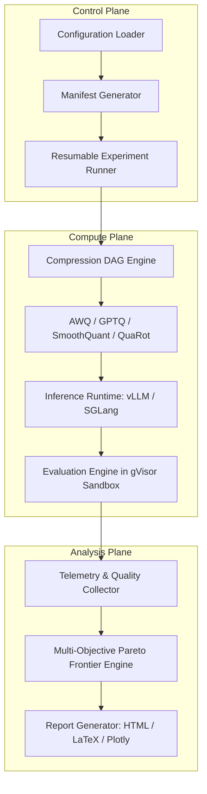

# ViPym System Architecture

ViPym decouples compression, serving, and evaluation to ensure domain-agnostic reusability and statistical reproducibility.

## Lifecycle States & Resumability

Experiments persist state at every boundary:
`CREATED -> VALIDATED -> BASELINE_RUNNING -> BASELINE_COMPLETED -> COMPRESSION_RUNNING -> COMPRESSION_COMPLETED -> INFERENCE_VALIDATED -> EVALUATION_RUNNING -> EVALUATION_COMPLETED -> ANALYSIS_COMPLETED -> REPORT_COMPLETED`

If interrupted or stopped due to an out-of-memory error or hardware preemption, re-running `vipym run --config <path>` will resume directly from the last completed stage.
