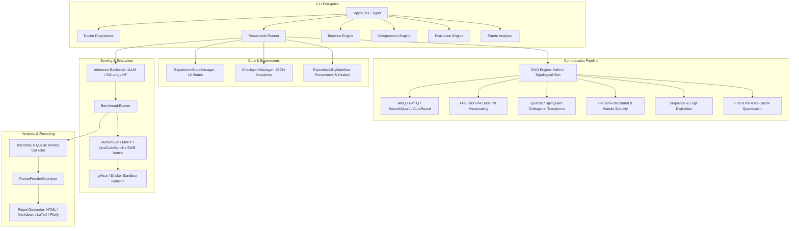

# ViPym — Current System Architecture

## Control & Data Flow

1. **Config Ingestion:** Pydantic v2 loads and strictly validates YAML configurations against schema definitions.
2. **Model Introspection:** Model adapters extract parameter counts, MoE expert counts, active routing, and context limits.
3. **Immutable Baseline:** Serves target model uncompressed; computes baseline Pass@1, TTFT, ITL, and peak VRAM.
4. **DAG Execution:** Topologically traverses and executes discrete compression stages, serializing artifacts.
5. **Sandboxed Evaluation:** Generates completions and executes unit tests in gVisor/Docker containers with zero network access and scrubbed environments.
6. **Multi-Objective Optimization:** Evaluates non-dominated Pareto frontier points across capability, memory, latency, and cost.
7. **Report Synthesis:** Generates interactive Plotly dashboards, Markdown summaries, and publication-ready LaTeX tables.
