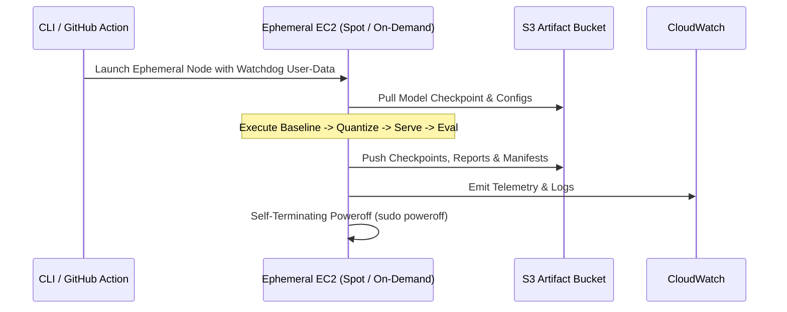

# AWS Ephemeral Orchestration & Cost Methodology

ViPym provides ephemeral cloud orchestration for large-scale GPU experiments (such as **Kimi K3** 2.8T MoE on multi-node p5.48xlarge clusters) without requiring permanent standing infrastructure.

## Ephemeral Lifecycle Flow

## Traceable Cost Formula

$$\text{Total Cost} = (T_{\text{baseline}} + T_{\text{compress}} + T_{\text{eval}}) \times R_{\text{EC2}} + (S_{\text{weights}} \times R_{\text{S3}}) + (D_{\text{egress}} \times R_{\text{transfer}})$$

All calculations are traceable to explicit parameters in `CostAssumptionConfig`.
