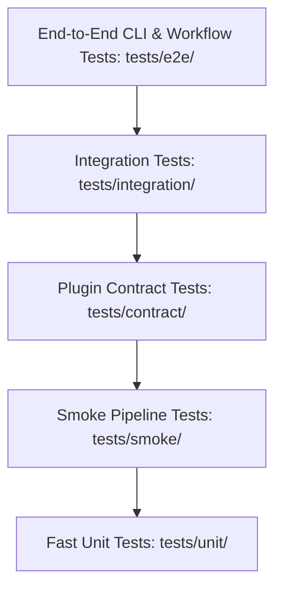

# ViPym — Comprehensive Test Strategy & Verification Methodology

**Test Architect:** Senior ML Systems Test Architect  
**Framework:** PyTest, PyTest-Asyncio, PyTest-Cov, PyTest-Mock  

---

## 1. Testing Pyramid & Layer Taxonomy

### Layer 1: Fast Unit Tests (`tests/unit/`)
- **Execution Time:** $< 100\text{ms}$ per test.
- **Dependencies:** Pure Python, in-memory objects, mock data, zero network calls.
- **Covered Domains:** Pydantic schema validation, DAG topological sort and cycle detection, Pareto dominance sorting, AST validation, state machine transition checks, cost calculations.

### Layer 2: Plugin Contract Tests (`tests/contract/`)
- **Purpose:** Verifies that all registered plugins strictly adhere to Abstract Base Class interfaces (`ModelAdapter`, `CompressionMethod`, `InferenceBackend`, `EvaluationSuite`, `CostModel`, `ArtifactStore`).
- **Invariants:** Validates property getters, capability schemas, and required methods without executing heavy GPU computation.

### Layer 3: Integration Tests (`tests/integration/`)
- **Purpose:** Exercises multi-stage component interactions (e.g. Teacher synthetic data generation $\to$ dataset caching $\to$ student distillation).

### Layer 4: End-to-End Smoke Tests (`tests/smoke/`)
- **Purpose:** Executes complete lifecycle from YAML config ingestion $\to$ Baseline $\to$ DAG compression $\to$ Serving $\to$ Sandbox evaluation $\to$ Multi-objective Pareto optimization $\to$ HTML/LaTeX/Markdown report generation on synthetic mock models.

### Layer 5: End-to-End CLI Tests (`tests/e2e/`)
- **Purpose:** Exercises the Typer CLI commands (`vipym --version`, `vipym doctor`, `vipym validate`, `vipym inspect-model`, `vipym list-*`).
